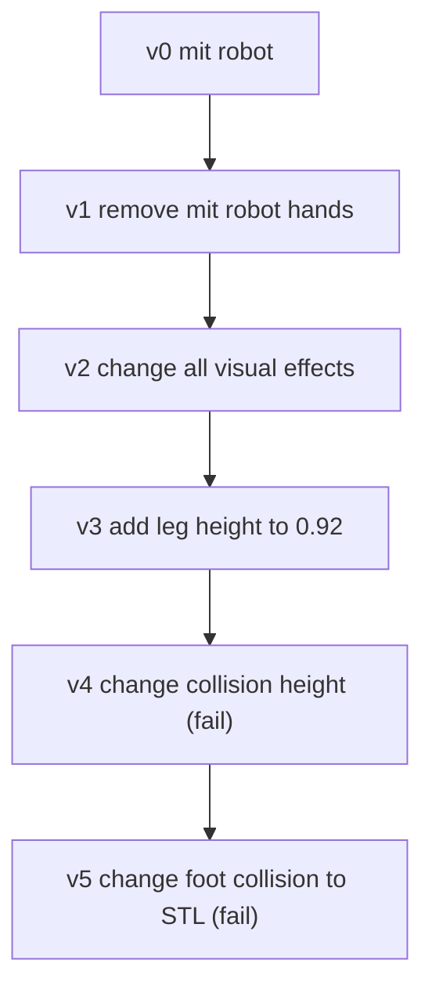

I love Robots!!!

```mermaid
flowchart TD
  v0["v0 mit robot"]
  v1["v1 remove mit robot hands"]
  v2["v2 change all visual effects"]
  v3["v3 add leg height to 0.92"]
  v4["v4 change collision height (fail)"]
  v5["v5 change foot collision to STL (fail)"]
  v0 --> v1
  v1 --> v2
  v2 --> v3
  v3 --> v4
  v4 --> v5
```

